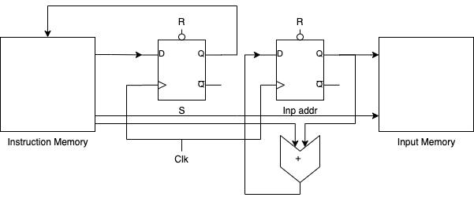

# Turing Machine

Memory modules:

- Instruction/Program Memory
- Input Memory

Registers:

- Current state register (S)
- Input pointer/address (Inp addr)

One word in the instruction memory has the following layout:

|   Next state address  |   Next symbol   |     Tape shift   |
|:---:|:---:|:---:|
| S'[0] \| S'[1] | s'[0] \| s'[1] | m[0] \| m[1] |
| 14 \| 14 | 1 \| 1 | 1 \| 1 |

